o

```r
opts_chunk$set(warning=FALSE, message=FALSE)
```

# Loading ggplot


```r
library(ggplot2)
```

# Basic use with qplot

Load the sample data


```r
set.seed(1410)  # make the sample reproducible
head(diamonds)
```

```
##   carat       cut color clarity depth table price    x    y    z
## 1  0.23     Ideal     E     SI2  61.5    55   326 3.95 3.98 2.43
## 2  0.21   Premium     E     SI1  59.8    61   326 3.89 3.84 2.31
## 3  0.23      Good     E     VS1  56.9    65   327 4.05 4.07 2.31
## 4  0.29   Premium     I     VS2  62.4    58   334 4.20 4.23 2.63
## 5  0.31      Good     J     SI2  63.3    58   335 4.34 4.35 2.75
## 6  0.24 Very Good     J    VVS2  62.8    57   336 3.94 3.96 2.48
```

```r
dsmall <- diamonds[sample(nrow(diamonds), 100), ]
```


```r
qplot(carat, price, data=diamonds)
```

 

## Color, size, shape and other aesthetic attributes


```r
qplot(carat, price, data=dsmall, color=color, shape=cut, alpha=I(1/2))
```

 

## Plot geoms


```r
qplot(carat, price, data=dsmall, geom=c("point", "smooth"))
```

 

### Adding a smoother
There are many different smoother that can be used with `method` argument.


```r
qplot(carat, price, data=dsmall, geom=c("point", "smooth"), method="lm")
```

 

### Boxplots and jittered points


```r
qplot(color, price/carat, data=diamonds, geom="jitter")
```

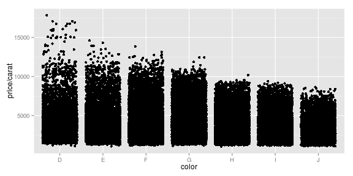 


```r
qplot(color, price/carat, data=diamonds, geom="boxplot")
```

 

### Histogram and density plots


```r
qplot(carat, data=diamonds, geom="histogram", fill=color)
```

 


```r
qplot(carat, data=diamonds, geom="density", color=color)
```

 

Change the amount of smoothing with `binwidth` argument.


```r
qplot(carat, data=diamonds, geom="histogram", binwidth=1)
```

 

```r
qplot(carat, data=diamonds, geom="histogram", binwidth=0.1)
```

 

```r
qplot(carat, data=diamonds, geom="histogram", binwidth=0.01)
```

 

### Bar charts


```r
qplot(color, data=diamonds, geom="bar")
```

 


```r
# bar plot of diamond color weighted by carat
qplot(color, data=diamonds, geom="bar", weight=carat) +
    scale_y_continuous("carat")
```

 

### Time series


```r
head(economics)
```

```
##         date   pce    pop psavert uempmed unemploy
## 1 1967-06-30 507.8 198712     9.8     4.5     2944
## 2 1967-07-31 510.9 198911     9.8     4.7     2945
## 3 1967-08-31 516.7 199113     9.0     4.6     2958
## 4 1967-09-30 513.3 199311     9.8     4.9     3143
## 5 1967-10-31 518.5 199498     9.7     4.7     3066
## 6 1967-11-30 526.2 199657     9.4     4.8     3018
```


```r
qplot(date, unemploy/pop, data=economics, geom="line")
```

 

## Faceting


```r
qplot(carat, data=diamonds, facets=color~.,
      geom="histogram", binwidth=0.1, xlim=c(0,3))
```

 

## Other options
- `xlim` and `ylim`: set limits for x- and y-axis (e.g. `xlim=c(0,20)`)
- `main`: main title for the plot
- `xlab` and `ylab`: labels for x- and y-axis


```r
qplot(carat, price, data=dsmall,
      xlab="Price ($)",
      ylab="Weight (carats)",
      main="Price-weight relationship")
```

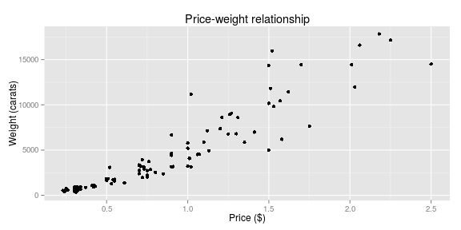 

# Build a plot layer by layer

More complicated, multi-layer plots can be generated using `ggplot()`.

## Basic plot types


```r
df <- data.frame(x=c(3, 1, 5), y=c(2, 4, 6), label=c("a", "b", "c"))
p <- ggplot(df, aes(x, y, label=label)) + xlab(NULL) + ylab(NULL)
```

### `geom_point`

```r
p + geom_point() + ggtitle("geom_point")
```

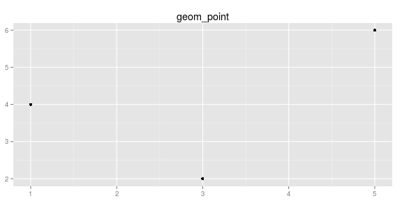 

### `geom_bar`

```r
p + geom_bar(stat="identity") + ggtitle("geom_bar(stat=\"identity\")")
```

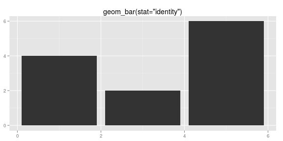 

### `geom_line`

```r
p + geom_line() + ggtitle("geom_line")
```

 

### `geom_area`

```r
p + geom_area() + ggtitle("geom_area")
```

 

### `geom_path`

```r
p + geom_path() + ggtitle("geom_path")
```

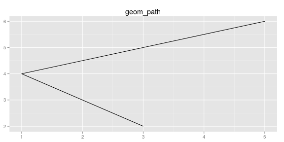 

### `geom_text`

```r
p + geom_text() + ggtitle("geom_text")
```

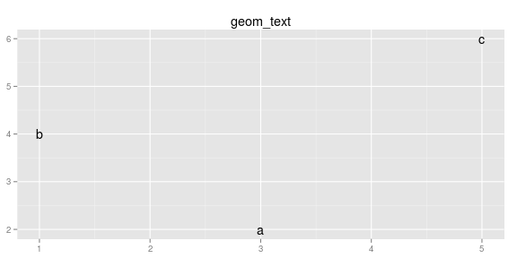 

### `geom_tile`

```r
p + geom_tile() + ggtitle("geom_tile")
```

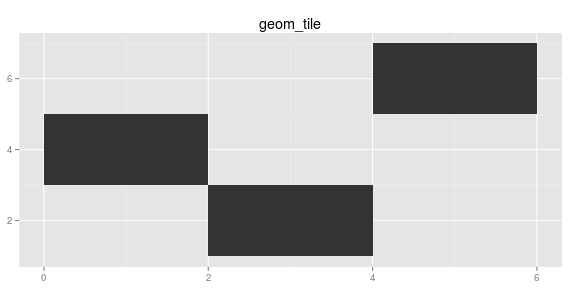 

### `geom_polygon`

```r
p + geom_polygon() + ggtitle("geom_polygon")
```

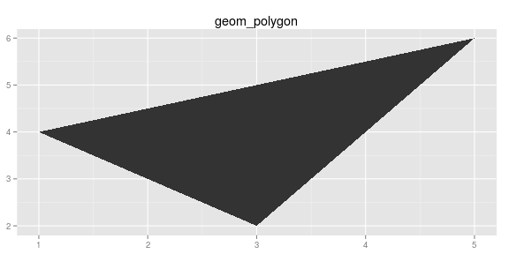 

## Displaying distributions

For 1d data, the geom is the histogram.

### `geom_histogram` and `geom_freqpoly`


```r
depth_dist <- ggplot(diamonds, aes(depth)) + xlim(58, 68)
depth_dist + geom_histogram()
```

 

To compare the distribution between groups, couple of options


```r
depth_dist + geom_histogram(aes(y = ..density..), binwidth=0.1) +
    facet_grid(cut ~ .)
```

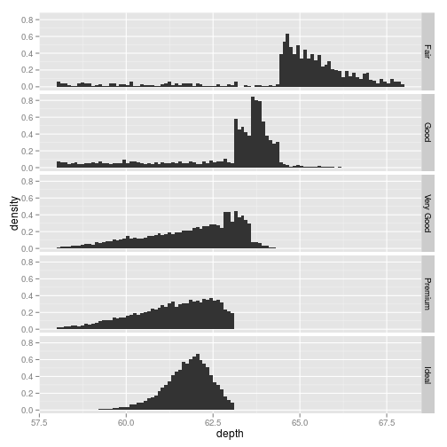 


```r
depth_dist + geom_histogram(aes(fill=cut), binwidth=0.1, position="fill")
```

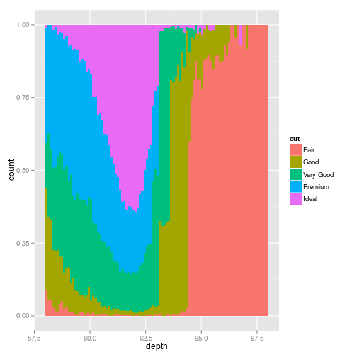 


```r
depth_dist + geom_freqpoly(aes(y = ..density.., color=cut), binwidth=0.1)
```

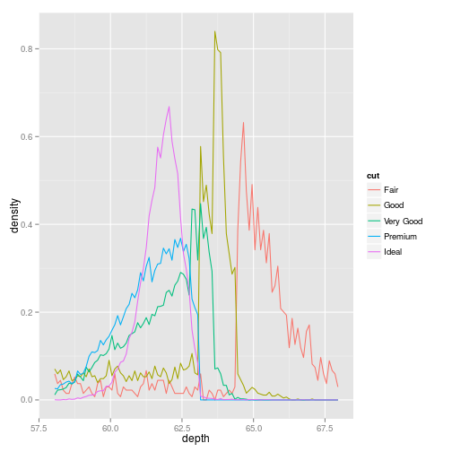 

### `geom_boxplot`


```r
qplot(cut, depth, data=diamonds, geom="boxplot")
```

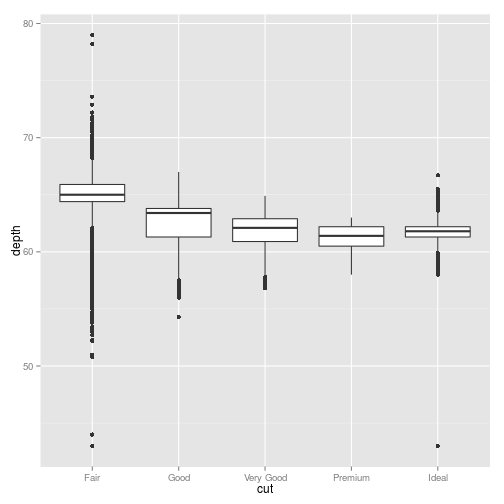 


```r
library(plyr)
qplot(carat, depth, data=diamonds, geom="boxplot",
      group = round_any(carat, 0.1, floor), xlim=c(0, 3))
```

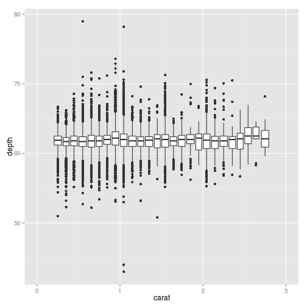 

### `geom_jitter`


```r
qplot(class, cty, data=mpg, geom="jitter")
```

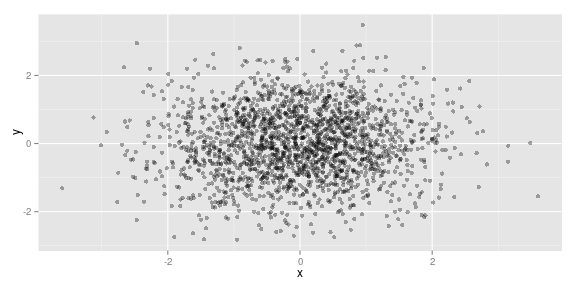 

```r
qplot(class, drv, data=mpg, geom="jitter")
```

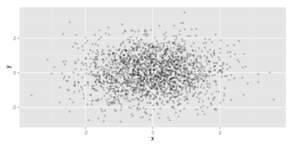 

